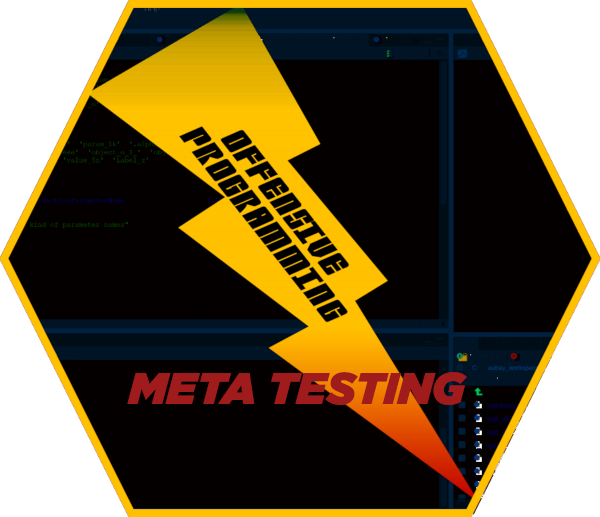

```{r setup, include = FALSE}
knitr::opts_chunk$set(collapse = TRUE, comment = "")
source('common-style.R')
```

Latest release replaces fully olders ones, that are now considered obsoletes. Keep the pace, and  upgrade your packages to use the latest version!

# name [awesome-asterion-khi] package-version [1.1.22] timestamp [2023-09-25 08:34:40]

1. CRAN note about item in Rd for 4.3.0 implies changes 
1. Changes applied to `r citefile("FunctionParameterTypeFactory.R")` 

# name [awesome-asterion-phi] package-version [1.1.21] timestamp [2021-10-05 20:33:52]

1. CRAN information on obsolescence of lubridate - need to remove dependency.
1. lubridate was speficied in files `r citefile("DESCRIPTION")` and `r citefile("NAMESPACE")`  
<pre>
tests/testthat/test_DataFactory.R:  expect_true(verifyFunction('x_da', lubridate::is.Date))
tests/testthat/test_DataFactory.R:  expect_true(verifyFunction('x_dc', lubridate::is.POSIXct))
</pre>
1. Test, Duration: `r citefigure('4.1')`, OK: `r citefigure('750')`
1. `r citeexec('R CMD check')`, Duration: `r citefigure('29.2s')`, 0 errors ✓ | 0 warnings ✓ | 0 notes ✓
1. `r citeval('Commercial software release management')`
1. `r citefolder('vignette')` content update
1. `r citeop("git")` alignment

# name [awesome-asterion-tau] package-version [1.1.19] timestamp [2020-11-09 19:49:02]

1. solved test issue related to R 4.0
1. enforced R 4.0
1. Test, Duration: `r citefigure('3.0s')`, OK: `r citefigure('491')`
1. `r citeexec('R CMD check')`, Duration: `r citefigure('33.9s')`, 0 errors ✓ | 0 warnings ✓ | 0 notes ✓
1. `r citeval('Commercial software release management')`
1. `r citefolder('vignette')` content update
1. `r citeop("git")` alignment


# Release awesome-asterion-nu - 1.1.13 - 2020-05-04

1. Test, Duration: `r citefigure('2.9s')`, OK: `r citefigure('475')`
1. `r citeexec('R CMD check')`, Duration: `r citefigure('27.9s')`, 0 errors ✓ | 0 warnings ✓ | 0 notes ✓
1. `r citeval('Commercial software release management')`
1. `r citefolder('vignette')` structure update
1. `r citefolder('vignette')` content update

# Release 1.1.12 - April, 22th 2020 

1. Test, Duration: `r citefigure('2.9s')`, OK: `r citefigure('475')`
1. R CMD check, Duration: `r citefigure('28.2s')`, 0 errors ✓ | 0 warnings ✓ | 0 notes ✓
1. Reviewed all documentation
1. Upgraded and updated vignettes

# Release 1.1.4 - January 2020 

Main improvements are 

1. removed environment variable `r citecode("OP_DATA_FACTORY")` management. Replaced by `r citecode("options('op_mt_data_factory')")`
1. solved CRAN compilation issue on older R release - enforced R dependency to R 3.6 or higher
1. **packageFunctionsInformation** renamed to **metaTestingInformation** to avoid name collisions
1. **metaTestingInformation** verified and upgraded
1. redesign of vignette files - now industrialized with external style
1. Worked on test coverage to reach level higher than 99%
1. cleaned up dependencies
1. Reviewed and cleaned up code - 23 files - 18 exported function - 9 internals
1. Reviewed and cleaned up manual pages - 13 files
1. Reviewed and updated tests - 21 files - 475 unit tests
1. Vignettes upgraded - 1  vignette
1. Timing for tests 3s, checks 27s

# Release 1.1.3 - Octobre 2019

Main improvements are 

1. enhanced implementation
1. completed unit tests
1. enforced higher code coverage (from 55.23% up to 100%)
1. documentation completion
1. clean up package dependencies. 

This release replaces fully olders ones, that are now considered obsoletes. 


